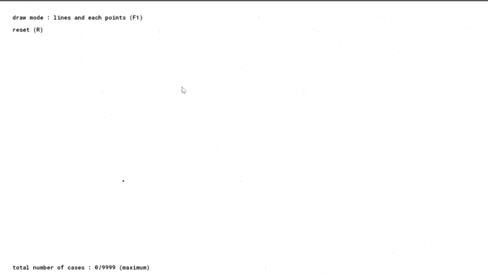
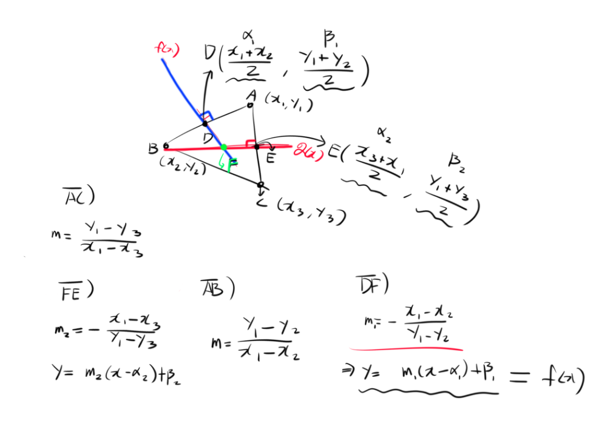

# delaunay-trianglulation

### 들로네의 삼각분할 (delaunay trianglulation)

학교 활동인 수학주제탐구 활동을 위해 제작한 프로젝트

#

### 들로네의 삼각분할이란?
-------------

들로네 삼각분할은 평면위의 점들을 삼각형으로 연결하여 공간을 분할할 때, 

이 삼각형들의 내각의 최소값이 최대가 되도록 하는 분할을 말한다.

#### ▼ 들로네의 삼각분할의 실제 활용도 및 여러 자세한 내용은 아래 내용 참고

https://darkpgmr.tistory.com/96


#

### ▼ 참고 사항
-------------

코드 내용 설명은 주석이 달려있지만, 대략적인 알고리즘을 보길 권장

#### ▼ 대략적인 알고리즘

https://github.com/ABER1047/delaunay-trianglulation/blob/main/README.md#-%EB%8C%80%EB%9E%B5%EC%A0%81%EC%9D%B8-%EC%95%8C%EA%B3%A0%EB%A6%AC%EC%A6%98-

#### ▼ 해당 알고리즘을 이용하여 제작한 계산식 코드

https://github.com/ABER1047/delaunay-trianglulation/blob/main/scripts/get_triangle/get_triangle.gml

#

<div align="center">

### ▼ 미리보기

  

  
</div>

#

### ▼ 대략적인 알고리즘 :
-------------


먼저 좌표평면 위 특정한 삼각형에서의 외심을 구해야 한다


- **외심의 좌표 유도 (방법 1) [가장 기본적인 방법이지만, 코드로써 표현 불가]**

```
이때, 각 꼭짓점을 A, B, C라고 하였을때, 
A(x1,y2), B(x2,y2), C(x3,y3)라고 하였을때, 3개의 변의 길이는 각각 L1, L2, L3라 하고 
L1 = √[(x2 - x1)2 + (y2 - y1)2] … (이하 생락) 일때, 
삼각형의 외심의 좌표는 A,B,C 각 점들에서의 거리가 모두 같은 곳에 존재함을 이용해 외심 구하기
```

</br></br>


- **외심의 좌표 유도 (방법 2) [처음부터 직접 구상함]** - (단순 기하학적인 내용과 다항함수만을 사용한 방법 - 삼각함수 방법보다 훨씬 빠름)


<div align="center">
  

  
</div>

```
직선 L1, L2, L3의 중심 좌표의 값과 삼각형을 이루고 있는 직선들의 기울기를 구하고, 이를 엮어
삼각형의 외심의 중심은 수직 이등분선의 교점이라는 사실을 이용해, 두 직선의 교점의 좌표값 X,Y를 구할수 있음
이때 이 두 선의 교점의 좌표가 외심의 좌표가 된다.

식으로 나타내자면 다음과 같다.
먼저 외심의 좌표를 F(X,Y)라고 하였을 때
선분 DF의 기울기는 m1 = -(x1 - x2) / (y1 - y2)라 정의 가능하고 (두 직선 그래프의 수직 관계 이용)
마찬가지로 선분 FE의 기울기 m2 = -(x1 - x3) / (y1 - y3)라 정의 할 수 있다.

이후 선분 AB와 AC의 중점인 D와 E의 좌표를 구하면
D((x1 + x2) / 2, (y1 + y2) / 2)
E((x1 + x3) / 2, (y1 + y3) / 2)
이며, 이를 각각 D(α1, β1), E(α2, β2)라고 정의 한다.

이후 선분 DF와 선분 FE를 함수로 나타내면,
f(x) = m1(x - α1) + β1 (선분 DF)
g(x) = m2(x - α2) + β2 (선분 FE) 이며,
이 두 함수를 서로 연립하면,
m1(x - α1) + β1 - (m2(x - α2) + β2) = 0
x(m1 - m2) - z = 0, (이때 z = m1*α1 + m2*α2 + β1 - β2 이라고 정의 [치환])
즉 x = -z / (m1 - m2) 이다.

따라서 외심 F의 좌표를 F(X,Y)라 할 때,
X = -z / (m1 - m2)
Y = f(X) = f(-z / (m1 - m2)) 이다.

```

</br></br>


- **외심의 좌표 유도 (방법 3) [외심의 좌표 공식만을 베이스로 구상함]** - (삼각함수 관련 공식과 정리를 사용한 방법)

#### ▼ 외심의 좌표 공식 증명은 이쪽 참고

https://math.stackexchange.com/questions/3472719/prove-x-coordinate-of-circumcenter-of-triangle-abc-is-x1-sin2ax2-sin2bx3-s


**(아래 과정 부터 다시 직접 계산함)**

```

외심의 좌표를 D(X,Y)라고 할때,
이때 X는 [(x1 sin 2A + x2 sin 2B + x3 sin 2C)/ (sin 2A + sin 2B + sin 2C)] 
이때 Y는 [(y1 sin 2A + y2 sin 2B + y3 sin 2C)/ (sin 2A + sin 2B + sin 2C)] 이다.

이때 sin 2A ...들의 값은 sinA와 cosA값을 이전에 이미 구했음으로 이를 이용하면, 

sin2A = sin(A + A) = sinA x cosA + cosA x sinA = 2(sinA*cosA)
(나머지 sin2B, sin2C도 같은 방식으로 구할수 있다.)

이때의 외접원의 반지름을 구하기 위해, 
코사인 법칙을 사용하여 cosA를 구한다.

cos(A) = (L3^2 + L1^2 - L2^2)/(2 x L3 x L1)

이때 [cos(A)^2 + sin(A)^2 = 1] 임을 변형해, 
sin(A) = √[1 - cos(A)^2]임을 구할 수 있다.

따라서 식을 정리하면,
sin2A = 2(√[1 - cos(A)^2] * cosA) 이다.

```

</br></br>

- **외심의 좌표를 구한 이후의 과정**


```
들로네 삼각분할 법칙에 의해, 각 꼭짓점을 이어 만든 삼각형의 외심 내부에는 어떠한 점도 존재하면 안되므로,
특정 삼각형의 외심의 좌표 D(X,Y)와 각 점들의 좌표 P(X,Y)의 거릿값이 외접원의 반지름보다 커야한다.

sin(A)/L2 = 2R (이때 R은 외접원의 반지름)을 통해 특정 삼각형의 외접원의 반지름을 구할 수 있다.

이후, 좌표 평면위에 있는 랜덤한 3개의 점들을 서로 연결하여 삼각형을 만든 뒤, 
이때의 외접원의 반지름의 길이와, 각 점들의 좌표를 통해 구한 외심으로부터, 각 점들까지의 거리를 비교해, 
만약 해당 삼각형의 외심원이 현재 연결된 삼각형의 점이 아닌 모든 다른점으로부터의 거리 값이 외접원의 반지름 보다 크면 해당 삼각형을 유지하고, 
아닌 경우, 해당 삼각형을 지우고, 위와 같은 과정을 더 이상 만들 수 있는 새로운 삼각형의 경우가 없을때까지 반복
```

#

- 2022-07-23 추가 

일부 3개 이상의 점이 극히 작은 소수점 단위의 차이로 

거의 비슷하게 한 직선 위에 있을경우 선이 이상하게 이어지는 경우가 있음.

#


- 2022-07-25 추가

위에 말한 선이 이상하게 이어지는 현상이 발생하는 원인 발견

(3개 이상의 점이 특정 한 직선에 엄청 가깝게 배치돼있으면, 외접원이 너무 커져서 해당 값을 계산 못하는거 같음)


도형과 텍스트 글자 표기, 카메라 움직임 관련 코드를 제외한 

나머지, 순수 알고리즘 관련된 부분들의 코드들의 게임메이커 언어적인 부분 전부 제거 했음

#

- 2022-08-20 추가

앞서 말한 잘못된 선이 그려지는 버그 수정

(각 점들의 기울기 값을 비교하여 한 직선상에 존재 하는지 체크하여 잘못된 선이 그려지는것을 방지)
